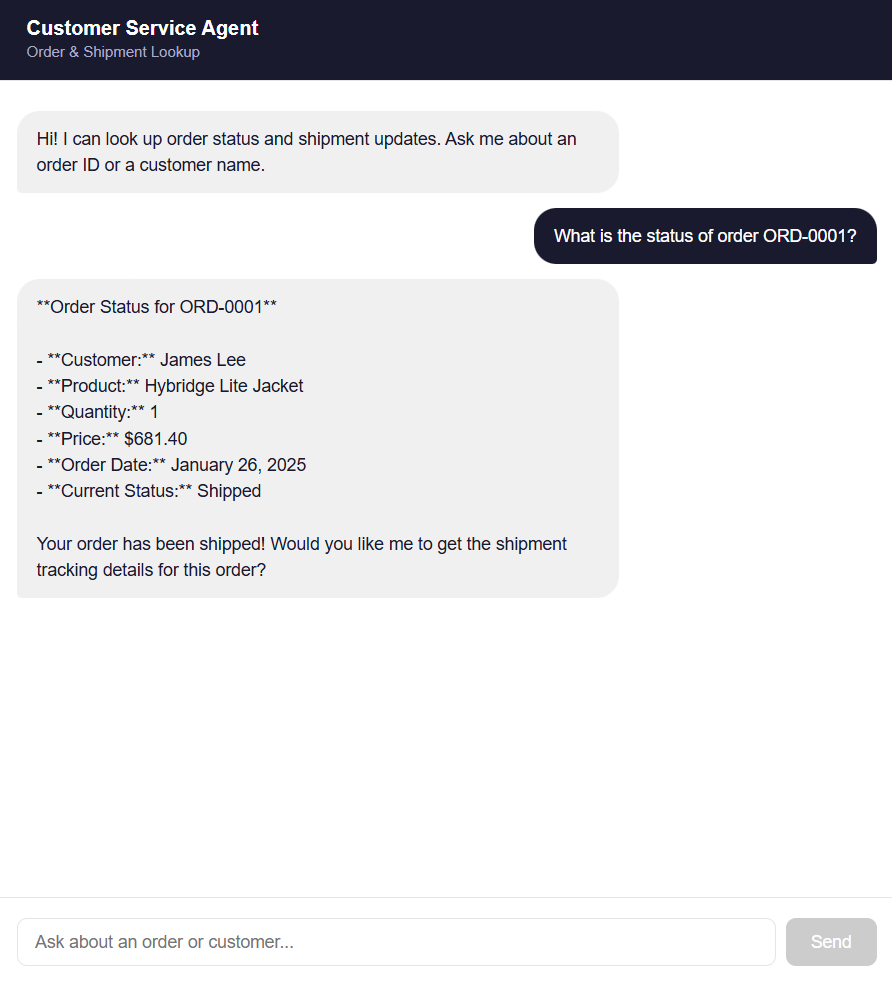

# Customer Service Agent

AI-powered customer service agent for order and shipment lookups, built with AWS Bedrock (Claude Haiku 4.5), Lambda, S3, Athena, and a React frontend deployed on AWS Amplify - exposed via an MCP server so any MCP-compatible client can query it in natural language. Modeled after real B2B manufacturing operations at a company I worked for.

---

## Overview

Customer service reps at manufacturing companies spend a significant portion of their day navigating multiple systems to answer basic questions: *Where is this order? What's the tracking status? When will it arrive?* At this specific company, this meant manually querying Dynamics 365 F&O across order and shipment modules for every customer inquiry.

This project replaces that workflow with a natural language agent. A CS rep types a question in plain English, and the agent retrieves the answer directly from the data - no SQL, no system navigation required.



---

## Architecture

```
CS Rep (natural language question)
            │
      ┌─────┴──────┐
      ▼            ▼
Amplify Chat UI   MCP Server (stdio)
      │            │
      ▼            ▼
API Gateway   Amazon Bedrock Agent (Claude Haiku 4.5)
      │            │
      ▼     ┌──────┴──────┐
   Lambda   ▼             ▼
    API   Lambda        Lambda
   Handler get_order_status  get_shipment_update
            │             │
            └──────┬──────┘
                   ▼
            Amazon Athena
                   │
                   ▼
               Amazon S3
          (orders.csv / shipments.csv)
```

**Services used:**
- **MCP Server** - stdio server that exposes the Bedrock agent as a tool to any MCP-compatible client
- **AWS Amplify** - hosts the React chat frontend for CS reps
- **Amazon API Gateway** - HTTP endpoint connecting the frontend to the API handler Lambda
- **Amazon S3** - stores synthetic order and shipment datasets
- **Amazon Athena** - serverless SQL queries directly on S3 data
- **AWS Lambda** - serverless functions that handle tool execution and API requests
- **Amazon Bedrock Agents** - orchestration layer that routes natural language to the right Lambda tool
- **Claude Haiku 4.5** - the underlying LLM that interprets questions and formulates responses
- **AWS IAM** - role-based access control across all services
- **Amazon CloudWatch** - Lambda execution logging and monitoring

---

## What It Does

Ask the agent questions like:

- *"What is the status of order ORD-0042?"*
- *"Has ORD-0015 shipped yet?"*
- *"What carrier is handling order ORD-0023 and when will it arrive?"*
- *"Find all orders for Metro Grocery Co."*
- *"Show me all 28oz Rectangle orders"*

The agent decides which tools to call, retrieves the data, and returns a clear, professional response - without the rep ever touching a database.

---

## Data

Synthetic dataset of 100 orders and 37 shipments generated to mirror B2B manufacturing order data from D365 F&O. Customers are businesses (delis, caterers, grocery chains) placing bulk orders for packaging products such as deli containers, round containers, rectangle containers, lids, and specialty containers.

**Orders table:** order_id, customer_id, customer_name, product_name, sku, category, quantity, unit_price, total_price, order_date, status

**Shipments table:** shipment_id, order_id, carrier, tracking_number, ship_date, estimated_delivery, status

Data is stored as CSV in S3 and queried via Athena - no database server required.

---

## Project Structure

```
Customer-Service-Agent/
├── README.md
├── mcp_server.py               # MCP server - exposes Bedrock agent via stdio
├── data/
│   ├── generate_data.py        # Synthetic data generator
│   ├── orders.csv              # Sample orders data
│   └── shipments.csv           # Sample shipments data
├── lambda/
│   ├── get_order_status.py     # Lambda: order and customer lookup tool
│   ├── get_shipment_update.py  # Lambda: shipment tracking tool
│   └── api_handler.py          # Lambda: API handler for Amplify frontend
├── frontend/
│   ├── index.html
│   ├── package.json
│   ├── vite.config.js
│   └── src/
│       ├── App.jsx             # React chat UI
│       ├── main.jsx
│       └── index.css
└── athena/
    └── setup.sql               # Athena database and table setup
```

---

## Setup

### Prerequisites
- AWS account with Bedrock access (Claude Haiku 4.5 via AWS Marketplace)
- Python 3.11+
- AWS CLI configured
- Claude Desktop (to connect via MCP server)

### 1. Generate synthetic data
```bash
cd data
python generate_data.py
```
Upload `orders.csv` and `shipments.csv` to an S3 bucket.

### 2. Set up Athena
Run the SQL in `athena/setup.sql` in the Athena query editor, pointing to your S3 bucket.

### 3. Deploy Lambda functions
- Create three Lambda functions in us-east-1 (Python 3.12)
- Attach an IAM role with S3, Athena, Bedrock, and CloudWatch permissions
- Deploy `lambda/get_order_status.py`, `lambda/get_shipment_update.py`, and `lambda/api_handler.py`
- Add resource-based policy on each Lambda allowing Bedrock agent to invoke it
- Set timeout to 30 seconds on the API handler Lambda

### 4. Create Bedrock Agent
- Region: us-east-1
- Model: Claude Haiku 4.5 (Global inference profile)
- Add two action groups pointing to the Lambda functions
- Grant the Bedrock execution role `bedrock:InvokeModel` and inference profile permissions

### 5. Set up API Gateway
- Create a REST API with a `/chat` POST endpoint
- Enable Lambda proxy integration pointing to `api_handler.py`
- Enable CORS (Default 4XX, Default 5XX, Allow-Origin: *)
- Deploy to `prod` stage

### 6. Deploy frontend to Amplify
- Connect GitHub repo to AWS Amplify
- Set root directory to `frontend/` via the build YML
- Amplify auto-deploys on every push to main

### 7. Run the MCP server
```bash
pip install mcp==1.3.0 boto3
python mcp_server.py
```

### 8. Connect to Claude Desktop
Add to `%APPDATA%\Claude\claude_desktop_config.json`:

```json
{
  "mcpServers": {
    "cs-agent": {
      "command": "python",
      "args": ["path/to/mcp_server.py"]
    }
  }
}
```

Restart Claude Desktop - the `query_customer_service` tool will appear under Connectors.

---

## Challenges & Lessons Learned

This project involved more AWS configuration than code - which turned out to be the real learning.

**Region availability**
Bedrock Agents with newer Anthropic models only works reliably in us-east-1. Always check regional service availability before starting infrastructure work.

**IAM permissions across services**
Bedrock Agents, Lambda, and Athena each require their own trust relationships and permission boundaries. The Bedrock execution role needs explicit `bedrock:InvokeModel` permissions and cross-region inference profile access - neither is attached by default. Debugging 403s across three services made IAM fundamentals very concrete.

**Lambda response format**
Bedrock Agents expects a specific response envelope from Lambda functions - `messageVersion`, `actionGroup`, `functionResponse` - that differs from standard Lambda invocation responses. The agent fails if this format is wrong.

**AWS Marketplace model subscriptions**
Newer Anthropic models on Bedrock require an AWS Marketplace subscription even for personal accounts. This wasn't obvious from the console and took time to diagnose. The error message points to IAM permissions, but the real fix is completing the Marketplace subscription flow.

**MCP server API versioning**
MCP 2.0.0 has a breaking API change from 1.x - `Server.list_tools()` decorator and `stdio_server` usage differ significantly. Pinning to `mcp==1.3.0` resolved compatibility issues.

**API Gateway body parsing**
Lambda proxy integration passes the request body as a JSON string, not a parsed object. The handler must check `isinstance(body, str)` and parse accordingly - otherwise the query field is never found and the function returns 400.

**Browser CORS on API Gateway**
Enabling CORS on the resource alone is not enough - Default 4XX and Default 5XX gateway responses also need CORS headers, otherwise error responses from the API block the browser before the error message can be read.